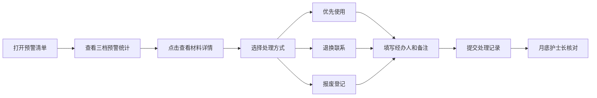

## 1. 产品概述

面向口腔诊所库房管理员的材料效期预警管理系统，重点管理树脂、粘接剂、麻药、根管糊剂、印模材料等有明确有效期的耗材，通过入库登记和智能预警，避免临床治疗时发现材料过期或临期。

- 解决问题：口腔耗材效期管理混乱，临期/过期材料无法及时发现，存在医疗安全隐患
- 目标用户：库房管理员、护士长
- 核心价值：提前预警、快速定位、规范处理、可追溯核对

## 2. 核心功能

### 2.1 用户角色

| 角色 | 登录方式 | 核心权限 |
|------|----------|----------|
| 库房管理员 | 账号登录 | 入库登记、查看预警、处理临期/过期材料、记录领用 |
| 护士长 | 账号登录 | 查看预警清单、核对处理记录、月底盘点审核 |

### 2.2 功能模块

1. **预警清单页（首页）**：效期概览统计、三档预警列表（90天/30天/7天）、材料详情、处理操作
2. **入库登记页**：扫码/手动录入、材料信息表单、批量入库、入库历史

### 2.3 页面详情

| 页面名称 | 模块名称 | 功能描述 |
|----------|----------|----------|
| 预警清单页 | 顶部统计卡片 | 展示正常、临期、已过期材料数量及占比，点击可筛选 |
| 预警清单页 | 三档预警标签 | 90天、30天、7天三档切换，红色/橙色/黄色分级警示 |
| 预警清单页 | 预警列表 | 材料名称、批号、规格、剩余天数、数量、存放位置、状态标签 |
| 预警清单页 | 材料详情弹窗 | 同批次详情、领用记录、存放位置、处理历史 |
| 预警清单页 | 处理操作 | 优先使用、退换联系、报废登记，填写经办人和备注 |
| 入库登记页 | 入库表单 | 材料名称、批号、规格、有效期、存放位置、数量输入 |
| 入库登记页 | 扫码录入 | 模拟扫码快速录入（支持手动输入条码） |
| 入库登记页 | 材料分类选择 | 树脂、粘接剂、麻药、根管糊剂、印模材料、其他 |
| 入库登记页 | 入库记录 | 近期入库历史列表，可查看和撤销 |
| 入库登记页 | 快速选择常用材料 | 常用材料快捷按钮，一键填充信息 |

## 3. 核心流程

### 3.1 入库登记流程

库房管理员接收新耗材 → 打开入库登记页 → 扫码或手动录入材料信息 → 确认提交 → 系统自动计算效期 → 存入库存数据库

### 3.2 预警与处理流程

管理员打开首页 → 查看三档预警 → 点击材料查看详情 → 选择处理方式 → 填写经办人和备注 → 提交处理记录 → 护士长月底核对

## 4. 用户界面设计

### 4.1 设计风格

- **主色调**：医疗蓝（#1677ff）作为主色，代表专业、可信
- **辅助色**：
  - 红色（#ff4d4f）：已过期警示
  - 橙色（#fa8c16）：7天临期警示
  - 黄色（#fadb14）：30天临期提醒
  - 绿色（#52c41a）：90天以上正常
- **按钮风格**：圆角中等（6px），悬停有微阴影和颜色渐变
- **字体**：中文使用 "PingFang SC"、"Microsoft YaHei"，数字使用等宽字体增强可读性
- **布局风格**：顶部导航 + 左侧二级菜单 + 右侧内容区，卡片式布局
- **图标风格**：线性图标，统一2px描边，保持医疗行业的专业简洁感

### 4.2 页面设计概览

| 页面名称 | 模块名称 | UI元素 |
|----------|----------|--------|
| 预警清单页 | 顶部统计卡片 | 四色卡片并排（正常/90天/30天/7天/已过期），数字放大显示，悬停上浮效果 |
| 预警清单页 | 筛选标签栏 | 胶囊式标签，选中态高亮，带数量角标 |
| 预警清单页 | 预警列表 | 表格+卡片混合样式，每行带状态色条，剩余天数醒目显示 |
| 预警清单页 | 详情弹窗 | 右侧抽屉式弹窗，分区块展示基本信息、领用记录、处理记录 |
| 入库登记页 | 表单区域 | 分组表单，左侧标签右侧输入，必填项红星标注 |
| 入库登记页 | 扫码区域 | 大输入框带扫描图标，支持快速录入 |
| 入库登记页 | 常用材料 | 横向滚动的标签组，点击快速填充 |

### 4.3 响应式

- 以桌面端优先设计（1366px 及以上）
- 平板端自适应，统计卡片自动换行
- 支持触屏设备的点击区域优化
- 表格在小屏幕下转为卡片式列表展示

### 4.4 微动效

- 页面加载时元素依次淡入上移（staggered animation）
- 状态标签有呼吸动画效果（临期/过期）
- 按钮悬停有微妙的缩放和阴影变化
- 抽屉弹窗平滑滑入
- 数字变化有计数动画
