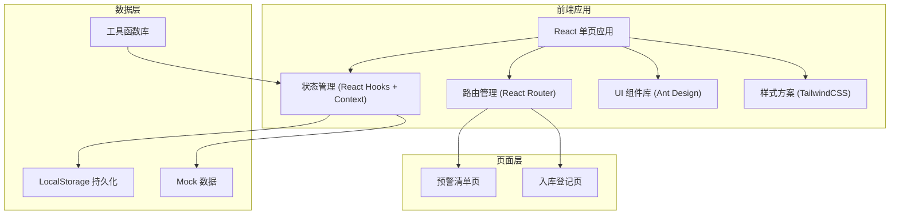
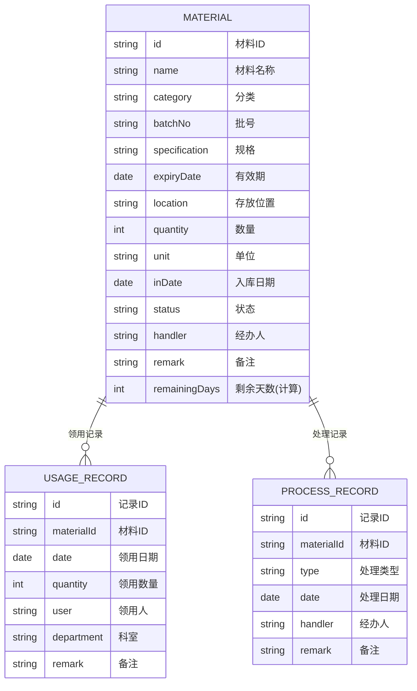

## 1. 架构设计



## 2. 技术描述

- **前端框架**：React 18 + TypeScript
- **构建工具**：Vite 5
- **路由管理**：React Router 6
- **UI 组件库**：Ant Design 5
- **样式方案**：TailwindCSS 3 + CSS 变量
- **状态管理**：React Hooks + Context API（轻量级，无需 Redux）
- **数据持久化**：LocalStorage（本地存储模拟后端）
- **图标库**：@ant-design/icons
- **日期处理**：dayjs

## 3. 路由定义

| 路由 | 页面 | 说明 |
|------|------|------|
| / | 预警清单页 | 首页，展示效期预警概览和列表 |
| /inventory | 入库登记页 | 材料入库登记和历史记录 |

## 4. 数据模型

### 4.1 数据模型定义



### 4.2 类型定义

```typescript
type MaterialCategory = 'resin' | 'adhesive' | 'anesthetic' | 'rootCanal' | 'impression' | 'other';

type MaterialStatus = 'normal' | 'warning90' | 'warning30' | 'warning7' | 'expired';

type ProcessType = 'priorityUse' | 'returnExchange' | 'scrap';

interface Material {
  id: string;
  name: string;
  category: MaterialCategory;
  batchNo: string;
  specification: string;
  expiryDate: string;
  location: string;
  quantity: number;
  unit: string;
  inDate: string;
  status: MaterialStatus;
  handler: string;
  remark?: string;
}

interface UsageRecord {
  id: string;
  materialId: string;
  date: string;
  quantity: number;
  user: string;
  department: string;
  remark?: string;
}

interface ProcessRecord {
  id: string;
  materialId: string;
  type: ProcessType;
  date: string;
  handler: string;
  remark?: string;
}
```

### 4.3 工具函数

```typescript
// 计算剩余天数
function getRemainingDays(expiryDate: string): number;

// 根据剩余天数获取状态
function getStatusByDays(days: number): MaterialStatus;

// 获取状态对应的颜色
function getStatusColor(status: MaterialStatus): string;

// 获取状态对应的文本
function getStatusText(status: MaterialStatus): string;

// 生成唯一ID
function generateId(): string;

// 材料分类选项
const CATEGORY_OPTIONS: { value: MaterialCategory; label: string }[];
```

## 5. 项目结构

```
src/
├── components/          # 公共组件
│   ├── Layout/         # 布局组件
│   ├── StatusTag/      # 状态标签
│   └── StatCard/       # 统计卡片
├── pages/              # 页面组件
│   ├── WarningList/    # 预警清单页
│   └── Inventory/      # 入库登记页
├── hooks/              # 自定义 Hooks
│   ├── useMaterials.ts # 材料数据管理
│   └── useLocalStorage.ts # 本地存储
├── types/              # TypeScript 类型定义
│   └── index.ts
├── utils/              # 工具函数
│   ├── date.ts         # 日期工具
│   └── status.ts       # 状态工具
├── mock/               # Mock 数据
│   └── data.ts
├── context/            # React Context
│   └── MaterialContext.tsx
├── App.tsx
├── main.tsx
└── index.css
```

## 6. 核心功能实现

### 6.1 效期计算逻辑

- 系统启动时遍历所有材料，根据当前日期和有效期计算剩余天数
- 状态分级：
  - 剩余 > 90 天：正常（绿色）
  - 30 < 剩余 ≤ 90 天：90天预警（黄色）
  - 7 < 剩余 ≤ 30 天：30天预警（橙色）
  - 0 < 剩余 ≤ 7 天：7天预警（红色浅）
  - 剩余 ≤ 0 天：已过期（红色深）

### 6.2 本地存储方案

- 使用 LocalStorage 存储材料数据、领用记录、处理记录
- 数据变化时自动同步到 LocalStorage
- 应用启动时从 LocalStorage 加载数据，若无数据则使用 Mock 数据初始化

### 6.3 预警清单筛选

- 支持按状态筛选（全部/正常/90天/30天/7天/已过期）
- 支持按分类筛选
- 支持按名称/批号搜索
- 支持按剩余天数升序/降序排列
